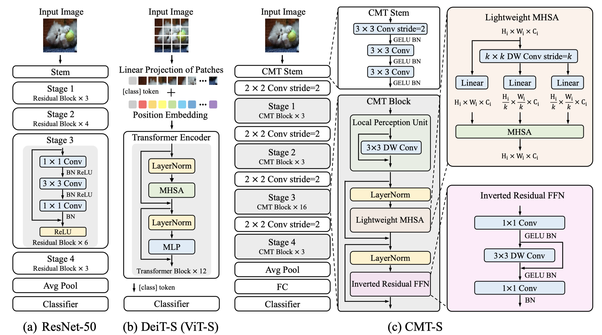

# CMT: Convolutional Neural Networks Meet Vision Transformers

### 1. Introduction


This repo is the CMT model which impelement with pytorch, no reference source code so  this is a **non-official** version.

### 2. Enveriments
- python 3.7+
- pytorch 1.7.1 
- pillow
- apex 
- opencv-python

You can see this [repo](https://github.com/NVIDIA/apex) to find how to install the apex 

### 3. DataSet
- **Trainig**
    ```
    /data/home/imagenet/train/xxx.jpeg, 0
    /data/home/imagenet/train/xxx.jpeg, 1
    ...
    /data/home/imagenet/train/xxx.jpeg, 999
    ```
- **Testing**
    ```
    /data/home/imagenet/test/xxx.jpeg, 0
    /data/home/imagenet/test/xxx.jpeg, 1
    ...
    /data/home/imagenet/test/xxx.jpeg, 999
    ```

### 4. Training & Inference

1. Training

    **CMT-Tiny**
    ```bash
    #!/bin/bash
    OMP_NUM_THREADS=1
    MKL_NUM_THREADS=1
    export OMP_NUM_THREADS
    export MKL_NUM_THREADS
    cd CMT-pytorch;
    CUDA_VISIBLE_DEVICES=0,1,2,3,4,5,6,7 python -W ignore -m torch.distributed.launch --nproc_per_node 8 train.py \ --batch_size 512 \ --num_workers 48 \ --lr 6e-3 \ --optimizer_name "adamw" \ --tf_optimizer 1 \ --cosine 1 \ --model_name cmtti \ --max_epochs 300 \
    --warmup_epochs 5 \ --num-classes 1000 \ --input_size 184 \ --crop_size 160 \ --weight_decay 1e-1 \ --grad_clip 0 \ --repeated-aug 0 \ --max_grad_norm 5.0 \
    --drop_path_rate 0.1 \ --FP16 0 \ --qkv_bias 1 \
    --ape 0 \ --rpe 1 \ --pe_nd 0 \ --mode O2 \ --amp 1 --apex 0 \ 
    --train_file $file_folder$/train.txt \
    --val_file $file_folder$/val.txt \
    --log-dir $save_folder$/log_dir \
    --checkpoints-path $save_folder$/checkpoints

    ```

2. Inference
    ```bash 
    #!/bin/bash
    cd CMT-pytorch;
    CUDA_VISIBLE_DEVICES=0,1,2,3,4,5,6,7 python -W ignore test.py \
    --dist-url 'tcp://127.0.0.1:9966' \ --dist-backend 'nccl' \ --multiprocessing-distributed=1 \ --world-size=1 \ --rank=0 \
    --batch-size 128 \ --num-workers 48 \ --num-classes 1000 \ --input_size 184 \ --crop_size 160 \
    --ape 0 \ --rpe 1 \ --pe_nd 0 \ --qkv_bias 1 \ --swin 0 \ --model_name cmtti \ --dropout 0.1 \ --emb_dropout 0.1 \
    --test_file $file_folder$/val.txt \
    --checkpoints-path $save_folder$/checkpoints/xxx.pth.tar \
    --save_folder $save_folder$/acc_logits/
    ```

3. calculate acc
    ```python 
    python utils/calculate_acc.py --logits_file $save_folder$/acc_logits/
    ```
### 5. Result
|model-name|input_size|FLOPs|Params|acc@one_crop(ours)|acc(papers)|weights|
|:---:|:---:|:---:|:---:|:---:|:---:|:---:|:---:|
|CMT-T|160x160|516M|11.3M|75.124%|79.2%|[weights](https://drive.google.com/file/d/1YngcCchrJ43bVWxuy4OiTfwy76gQyIBk/view?usp=sharing)|
|CMT-XS|192x192|-|-|-|81.8%|-|
|CMT-S|224x224|-|-|-|83.5%|-|
|CMT-L|256x256|-|-|-|84.5%|-|


### 6. TODO
- [ ] Other result may comming sonn if someone need.
- [ ] Release the CMT-XS result on the imagenet
- [ ] Check the diff with papers.
- [x] Adjusting the best hyperparameters for CMT or transformers

### Supplementary
If you want to know more, I give the CMT explanation, as well as the tuning and training process on [here](https://www.zhihu.com/people/flyegle).


